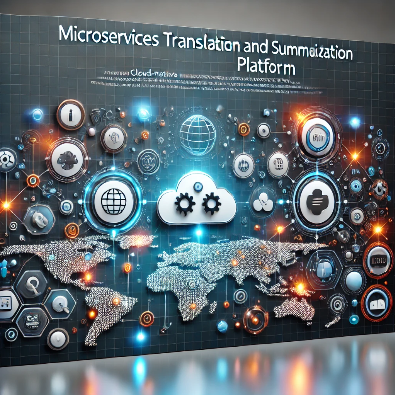

# **Microservices Translation and Summarization Platform**

  
  
  


---

## 📋 **Project Description**
This platform is a cloud-native microservices-based solution for real-time translation and text summarization. It uses advanced NLP models, a scalable architecture, and supports secure user management.

---

## 🖼️ **Banner**


---

## 🌟 **Features**
- Real-time English-to-Arabic and Arabic-to-English translation.
- Customizable summarization styles (formal, informal, technical).
- Secure and scalable microservices architecture.
- Asynchronous processing using Apache Kafka.
- Dockerized services for easy deployment.

---

## 🛠️ **Requirements**
- Python 3.9+
- Docker (for containerization)
- Postman (for API testing)

---

## 📦 **Installation**

### **EN2AR-Service (English to Arabic Translation)**
1. Clone the repository:
    ```bash
    git clone https://github.com/salahezzt120/microservices-translation-summarization-platform.git
    cd microservices-translation-summarization-platform/en2ar_service
    ```
2. Install dependencies:
    ```bash
    pip install -r requirements.txt
    ```
3. Run the service:
    ```bash
    uvicorn en2ar_service.main:app --host 0.0.0.0 --port 8000
    ```
4. Alternatively, build and run the Docker container:
    ```bash
    docker build -t en2ar-service .
    docker run -p 8000:8000 en2ar-service
    ```

### **AR2EN-Service (Arabic to English Translation)**
1. Clone the repository:
    ```bash
    cd microservices-translation-summarization-platform/ar2en_service
    ```
2. Install dependencies:
    ```bash
    pip install -r requirements.txt
    ```
3. Run the service:
    ```bash
    uvicorn ar2en_service.main:app --host 0.0.0.0 --port 8000
    ```
4. Alternatively, build and run the Docker container:
    ```bash
    docker build -t ar2en-service .
    docker run -p 8000:8000 ar2en-service
    ```

### **Text Summarization Service**
1. Clone the repository:
    ```bash
    cd microservices-translation-summarization-platform/text-summarization-service
    ```
2. Install dependencies:
    ```bash
    pip install -r requirements.txt
    ```
3. Run the service:
    ```bash
    uvicorn summarization_service.main:app --host 0.0.0.0 --port 8000
    ```
4. Alternatively, build and run the Docker container:
    ```bash
    docker build -t summarization-service .
    docker run -p 8000:8000 summarization-service
    ```

### **User Management Service**
1. Clone the repository:
    ```bash
    cd microservices-translation-summarization-platform/user-management
    ```
2. Install dependencies:
    ```bash
    pip install -r requirements.txt
    ```
3. Run the service:
    ```bash
    python user_management_service.py
    ```
4. Alternatively, build and run the Docker container:
    ```bash
    docker build -t user-management-service .
    docker run -p 8000:8000 user-management-service
    ```

---

## 📑 **Documentation**
For detailed API documentation, access FastAPI's Swagger UI:
- EN2AR-Service: http://localhost:8000/docs
- AR2EN-Service: http://localhost:8000/docs
- Text Summarization Service: http://localhost:8000/docs
- User Management Service: http://localhost:8000/docs

---

## Repository Links
For more information, visit the respective folders in this repository:
- [API Gateway](https://github.com/Youssef-Sabri/cse363-cloud-computing-Cloud_warriors-Multi-Lang-Microservices/tree/main/api-gateway)
- [Arabic to English Translation Service](https://github.com/Youssef-Sabri/cse363-cloud-computing-Cloud_warriors-Multi-Lang-Microservices/tree/main/ar2en_service)
- [English to Arabic Translation Service](https://github.com/Youssef-Sabri/cse363-cloud-computing-Cloud_warriors-Multi-Lang-Microservices/tree/main/en2ar_service)
- [Text Summarization Service](https://github.com/Youssef-Sabri/cse363-cloud-computing-Cloud_warriors-Multi-Lang-Microservices/tree/main/text-summarization-service)
- [User Management Service](https://github.com/Youssef-Sabri/cse363-cloud-computing-Cloud_warriors-Multi-Lang-Microservices/tree/main/user-management)
```
